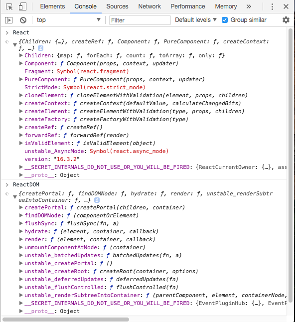

===========================
# Reactjs
===========================
On the launch page of Reactjs we can see
 - Declarative
 - Components
 - Learn Once Write Anywhere

Lets elaborate
### Declarative
We know that declarative programming hides the implementation/algorithm details and
allows the developer to operate the logic on the arguments
Eg: for loop --> *imperative*
    [].map   --> *declarative*
Similarly here,
With React we can write **Declarative Views** and React will take care of updating,
modifying based on the argument(scope)

### Component
In React everything is in javascript. View to be rendered on any platform is
expressed as simple js objects in React
Eg: css, html are expressed as objects for browser environment
The corresponding environment package, here **react-dom** will take care of rendering in
the actual html
This way of expressing the view technologies(html, css, IOS, android) in simple javascripts will allow the
developer to
  - to have complete controll over the code
  - can use all js features/powers *functional programming,composing software*
  - need not worry about the platform implementation details or platform specific code for achieving a behaviour

React supports components and component composition

### Learn Once, Write Anywhere
Since everything is javascript we know how react works, with the help of the platform
specific pakages *react-dom, react-native* we can write for any platform

--------------------------------
## What makes Reactjs powerful
--------------------------------
Manipulating DOM through browser's DOM api is slow and costly

Small comparison
### Normal DOM manipulation
  - query elements **READ**
  - modify the contents of the DOM **WRITE**
The above approach is costly and time consuming

### Backbone, Angular approach
 - Checks for the difference in the scope/model and DOM and updates(**WRITE**) the DOM
 - Only **WRITE** no **READ**
 - I think it rewrites the entire DOM
 - Problem is, it has to re-render/digest for applying the changes.*$apply - $watch -  $digest*

### React way
  - All operation **WRITE** and **READ** are done at the virtual DOM level *which is quicker*
  - updation **WIRTE** only happens on the *diffed* elements

Characterstics
  - virtual DOM // DOM Diffing and updating only the changes

--------------------------------
## A simple html with React
--------------------------------
In React, everything is expressed as javascript, javascript objects including html,css
The Virtual DOM is built with javascript. Hence its easier to manipulate the virtual DOM
as it is simply an JS Object.

### Step 1
  - Some introduction on React
  - setup folder structure
    - ./src contains all the js code that gets build to ./dist folder
    - ./dist is the formatted code that is runnable in all browsers. This is where the application runs

### Step 2 Pure React in browser

  - Load the react scripts ie. *react and react-dom* to index.html
  - As expected the script will publish react globals  
        

Of these some of the important methods are
  - React
    - createElement()

  - ReactDOM
    - render()  

Lets use these methods to build a simple element and render on html  

1. In order to render the page ReactDOM.render() needs
  - the **react-element** to render
  - container DOM to load the **react-element** and render
2. **react-element** is an object got from React.createElement() *signature is in code*
