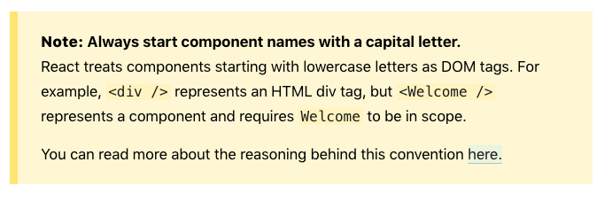
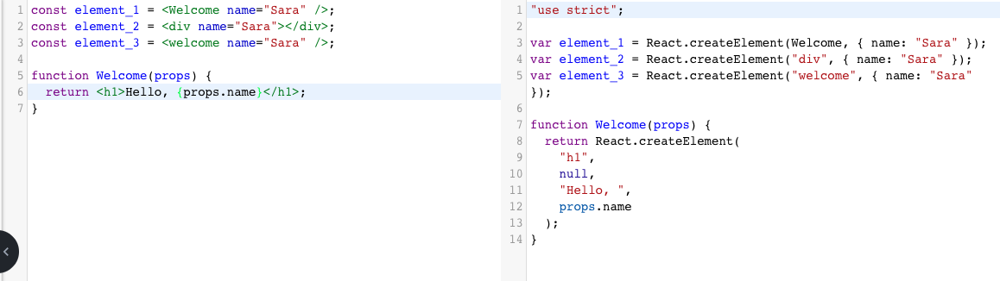
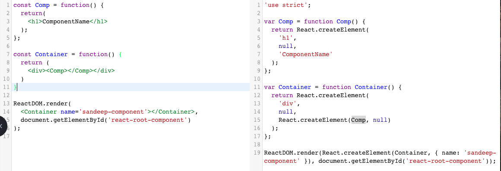

===========================
# Reactjs
===========================
On the launch page of Reactjs we can see
 - Declarative
 - Components
 - Learn Once Write Anywhere

Lets elaborate
### Declarative
We know that declarative programming hides the implementation/algorithm details and
allows the developer to operate the logic on the arguments
Eg: for loop --> *imperative*
    [].map   --> *declarative*
Similarly here,
With React we can write **Declarative Views** and React will take care of updating,
modifying based on the argument(scope)

### Component
In React everything is in javascript. View to be rendered on any platform is
expressed as simple js objects in React
Eg: css, html are expressed as objects for browser environment
The corresponding environment package, here **react-dom** will take care of rendering in
the actual html
This way of expressing the view technologies(html, css, IOS, android) in simple javascripts will allow the
developer to
  - to have complete controll over the code
  - can use all js features/powers *functional programming,composing software*
  - need not worry about the platform implementation details or platform specific code for achieving a behaviour

React supports components and component composition

### Learn Once, Write Anywhere
Since everything is javascript we know how react works, with the help of the platform
specific pakages *react-dom, react-native* we can write for any platform

--------------------------------
## What makes Reactjs powerful
--------------------------------
Manipulating DOM through browser's DOM api is slow and costly

Small comparison
### Normal DOM manipulation
  - query elements **READ**
  - modify the contents of the DOM **WRITE**
The above approach is costly and time consuming

### Backbone, Angular approach
 - Checks for the difference in the scope/model and DOM and updates(**WRITE**) the DOM
 - Only **WRITE** no **READ**
 - I think it rewrites the entire DOM
 - Problem is, it has to re-render/digest for applying the changes.*$apply - $watch -  $digest*

### React way
  - All operation **WRITE** and **READ** are done at the virtual DOM level *which is quicker*
  - updation **WIRTE** only happens on the *diffed* elements

Characterstics
  - virtual DOM // DOM Diffing and updating only the changes


## A simple html with React

In React, everything is expressed as javascript, javascript objects including html,css
The Virtual DOM is built with javascript. Hence its easier to manipulate the virtual DOM
as it is simply an JS Object.

### Step 1
  - Some introduction on React
  - setup folder structure
    - ./src contains all the js code that gets build to ./dist folder
    - ./dist is the formatted code that is runnable in all browsers. This is where the application runs


### Step 2 Pure React in browser

  - Load the react scripts ie. *react and react-dom* to index.html
  - As expected the script will publish react globals  
        

Of these some of the important methods are
  - React
    - createElement()

  - ReactDOM
    - render()  

Lets use these methods to build a simple element and render on html  

1. In order to render the page ReactDOM.render() needs
  - the **react-element** to render
  - container DOM to load the **react-element** and render
2. **react-element** is an object got from React.createElement() *signature is in code*


### Step 3 Pure React in browser Extended

Lets create react-elements with child tags
We will see how react-elements are simple js objects  
And how we can apply js composition techniques to
compose complex template.


### Step 4 Setup browserify to load modules

Since React follows most of the native js values. we will leverage it by using node style module loading thru browserify.  

  - install react, react-dom module from npm
  - load them in the browser thru browserify
  - remove the cdn scripts

Note:
Here we have dynamically added the data name in the react element  
with which we can use js techniques (reduce, map etc);

Also we have created a pure-react file for *modularisation*


#### Step 5 Introducing JSX for replacing complex react-element

Writing code with react-elements is difficult especially when the DOM
structure is huge  
Hence React guys used the JSX for constructing react-elemnts

##### What is JSX
JSX stands for Javasript XML


JSX is an XML-like syntax extension to ECMAScript without any *defined semantics*  
It is **NOT** intended to be implemented by engines or browsers  
**It's NOT a proposal to incorporate JSX into the ECMAScript spec itself.**  

It's intended to be used by various preprocessors (transpilers) to transform these **tokens** into standard ECMAScript.

```
const x = <h1>sandeep</h1>;
```
The above code if ran on node,browser it throws error.  
The browser or node cannot understand JSX notations.The transpilers like
babel will identify the JSX code and convert them to runnable js code.  

```
const x = <h1>sandeep</h1>;
```
is converted to

```
var x = React.createElement(
  "h1",
  null,
  "sandeep"
);
```

Here the object is wrapped by React.createElement(). This is due to *preset* set
in babel to react. so babel will assume that the JSX has to converted to a react-element.   
Hence the object is wrapped with React.createElement();  

We can use other *presets* to convert the JSX to whatever library specific code.

Note: JSX is independent of React. JSX ca be used anywhere.
[JSX site](https://facebook.github.io/jsx/)


In the illustration we will see how JSX gets converted to react-elements and
how dynamic data passing is still possible  

> Note: Make sure JSX expression returns a single element. Having adjacent elements or siblings
> will ask you to enclose the second element with expression syntax (expr)
> Avoid returning JSX with siblings. Instead separate them into components. This is more convenient and
> a best practice

##### What is Babel ?
Babel is a transpiler that converts all ES2015+ code ie. ES6,ES7,Typescript,JSX and
few other advanced js code to normal vanilla JS (ES2015)


babel-core // is the core package that contains logic to convert anything to js  
what to convert ie. ES6 -> ES5 or Promises -> polyfills are mentioned by **presets**  also called as plugins  
[Here is the list of presets](https://babeljs.io/docs/en/presets)  

Babel-cli package is used to transpile code with the help of babel-core and
related presets/plugins  

babel-cli looks for .babelrc file to see what format needs to be transpiled

```
{
  "presets": ["env"] // env represents all ES5+ codes not react or other special types
}
```


###### JSX is an Expression !
Since react-element is a js object/expression we can treat it like any other js
code and subject it to any js operations  
JSX itself is an expression and allows js expressions within them so that it can exhibit all the behaviours   

Expressions are enclosed by {js expressions}

> Best practice: Since JSX is an expression its better to treat them as expression by enclosing with (expr)

> Important: Inside JSX context all expressions should be enclosed by {}. Don't try to inline js blocks *{}*
> or function blocks. Instead treat JSX as a variable and use that variable in your functions or conditional expr

In short, don't do this

```
const heading = (
  //  expression
  if(!isBool){
    <h1 id='heading-4'>{family_1.name}</h1>
  }else{
    <h1 id='heading-4'>{family_2.name}</h1>
  }
);
```
Instead,
```
var head_1 = (<h1 id='heading-4'>{family_1.name}</h1>);
var head_2 = (<h1 id='heading-4'>{family_2.name}</h1>);

function getHeading(bool) {
  if(bool){
    return head_1;
  }else{
      return head_2
  }

}
// or

function getHeading(bool) {
  if(bool){
    return (<h1 id='heading-4'>{family_1.name}</h1>);
  }else{
      return (<h1 id='heading-4'>{family_2.name}</h1>)
  }

}
```

> Note: Don't interpolate the jsx {} expression with string. It wont transpile.For XML attributes
> either use curly braces {} or "". Not together in whichever fashion.  
> This can be handled by interpolating outside the jsx expression and providing the interpolated value


We have illustrated all the possible expressions applied on JSX  

> Note: JSX boils down to React.createElement() call which returns a simple object

> Info: JSX Prevents Injection Attacks


> Important Note: Since JSX is transpiled to a fixed code with React.createElement,
when requiring `react` module make sure the variable name matches the transpiled version


#### Step 6 Rendering Elements

React.render() method will render the react-element

> Note: react-elements are immutable. ie once created their attr,dom childs or anything cannot be
> modified. react-element is like a single frame in a movie. the frame represents the UI at a certain point
> Hence the only way to modify/update the react-element is by creating another react-element with the state changed
> and pass it React.DOM() to re-render


> React.DOM() while re-rendering will diff the existing react-element with the new react-element and *WRITES* only
> what is changed


The above is illustrated in dom (id = 'react-root-render')


### Step 7.1 Components - Functional component

React allows you to create components in 3 ways
[Three ways to create react components](https://medium.com/@the.benhawy/3-ways-to-create-react-components-8b3620e4ea0)


we will use the functional way as it is simple and aligns with functional values  
Understanding functional implementation of react components is simple  
We know that,
  - new object instance is received by returning an object literal
  - ReactDOM.createElement() returns a new object instance


Note:
```
React.createElement(
  type,
  [props],
  [...children]
)
```
type
  - string // for declaring html tags
  - function // that returns a react-elemt // for declaring components

When using JSX, babel transpiler will need to differentiate between the
**DOM** tags and **Cutom tags**
For that if a tag name
  - is in small letters // built-in dom
  - Starts with capital // Custom DOM with a corresponding function ref of *same name*






So whenever a JSX with custom tag starting with capital letter is used babel
transpiles them to functional reference.  
The function in turn should **return a react-elemnt**




### Step 7.2 Components - functional component - extended
- How to pass complex types as `props`
- function composition with different value

complex types Arrays, objects cannot be declared directly to JSX expression.
The transpiler cannot understand. Hence the complex values are passed as variable
reference


#### Note:
Functional components are pure functions. They dont modify the `props`


### Stateful Components using Class
Difference between State and Props
Props are input arguments supplied to the component thru DOM attributes.
States are ?

Responsibility of a Component:
- May have its own state. // state
- behaviour // method
- lifecycle hooks //
- should update itself when state is updated. // setState
- template // render


Note:
In two-way binding, the framework *itself* update the view, model during digest
cycles triggered by framework methods.

What makes a component to unmount?

What happens,
- `ReactDOM.render()` calls the Clock's constructor and initializes
state
- calls component's `render()` and updates DOM
- When render() output is inserted to DOM it triggers
`componentDidMount()`

Extended
#### Using props and states

> Because this.props and this.state may be updated asynchronously, you should not rely on their values for calculating the next state.

```
// Wrong
this.setState({
  counter: this.state.counter + this.props.increment,
});
```

```
// Correct
this.setState((state, props) => ({
  counter: state.counter + props.increment
}));
```

How to assign default values to `props` and `states`

#### State Updates are Merged // Object.assign()
states which are not mentioned are left as such


#### Data flows down


#### component composition


### Stateful Components using ReactClass module
- getDefaultProps
- getInitialState
- auto-binding


Note: We know that Classes are nothing syntactic sugar for constructor functions
Method Properties when using `this` will point to the context with which it is
called.
Class 
