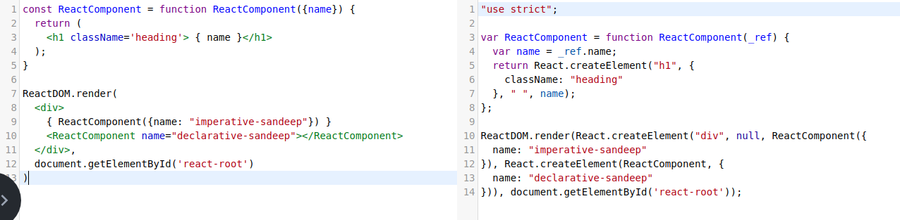

## Quick Recap

RR = ReactDOM.render()
RCE = React.createElement()
RE = object returned by RCE

### RE and RR

`React.render()` takes a `ReactElement` object to render

ReactElement is an **immutable object**. Meaning once the
object is created, its properties cannot be modified.

To update the element, we need to create a new RE and pass to RR

RE is created from `React.createElement()` RCE function


### RCE = JSX with properties

JSX = RCE

Both JSX and RCE returns the RE which the render function
needs


### RCE within functions
To create REs(objects) with different properties, we wrap them
in a function that returns RE

Note: params are destructured. You can also send primitive params

Here we need to invoke the function *imperatively*.
`getReactElement({name: "Navin"})`
RCE provides us a convenient way to achieve the same *declaratively* through
JSX


### Functional Components
A `Component` is a function that returns a RE!

Like previously said, RCE allows us to code components declaratively
```
{ ReactComponent({name: "imperative-sandeep"}) }

<ReactComponent name="declarative-sandeep"></ReactComponent>
```
Both are equal. yeilds the same result.

This is becaues,
RCE/JSX takes two types of arguments
  - string // for built-in DOM
  - function // custom tag/ component

RCE will invoke the *function* with the *props* supplied and returns an RE

Declarative JSX will convert to



`ReactComponent` function is invoked with `{ name: "declarative-sandeep"}` as
arguments/props and returns a new RE with the props composed.

The combination of RCE taking a function and capability of JSX tags referencing
the function leads us to write *declarative* syntax

This makes JSX to be declared multiple times, each returning a
ReactElement with props composed


## Component composition: Imperative

`props` can be anything from primitive, objects and even functions

We can compose components, by passing RE as a prop to another component


```
// take a number
// multiply by 10
// add 2

const f = (n) => (n * 10)
const g = (n) => (n + 2)

const h = (n) => {
  return g(f(n))
}

// take a span elem
// convert it a heading
// add border bottom

const f= (el) => (heading-with-el)
const g = (el) => (border-with-el)

const h = (span) => {
  return g(f(span))
}

```


## Component composition: Declarative

```
(
  <Border el={
    <Heading el= {el}/>
  }/>
);

```
The above code, first add heading and then border.
But when reading, it looks like Border and Heading. Order reversed.

This is similar to function composition. where the order is reversed.
For this we can use `compose/pipe` utils that will maintain the order

More on them later.


HOC
render-props


Component can be called multiple times with different arguments, just like
functions. each returning an RE.

Component = JSX with Custom tag. Babel when sees this structure, assumes that
Tag is a function and pass that function to RCE.


### Props // function arguments

Since Components are functions, Component properties can be anything
from primitive to objects, arrays and functions.


Wrapping a RCE() within a function is seen as a process of
  - returning a RE with properties.
  - componentize, invoked multiple times


### RE and RR
### RCE and JSX with properties
### RCE inside a function = component
### Component properties =function arguments // component composition

### Reusable Components // reder props, HOC

### Local state
### Lifting state
### Context


### Reusable states, hooks

### services, singleton, dependency injection
